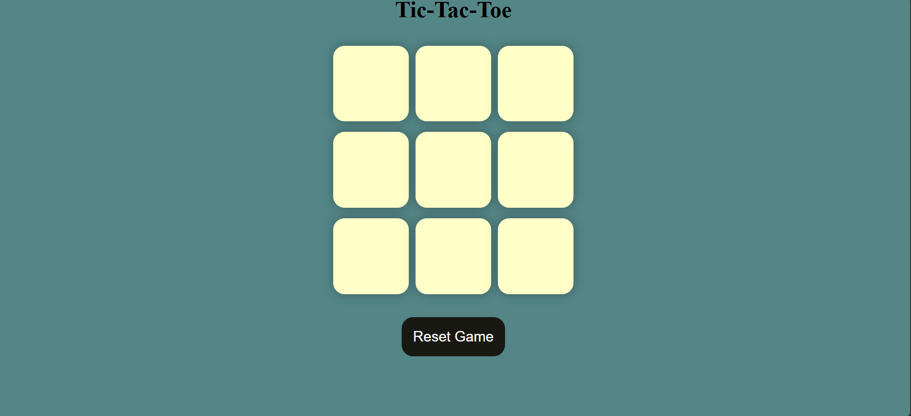
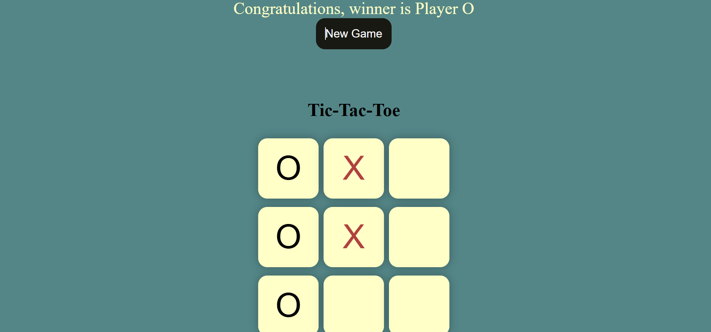
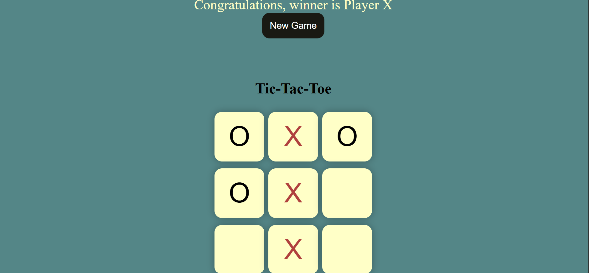
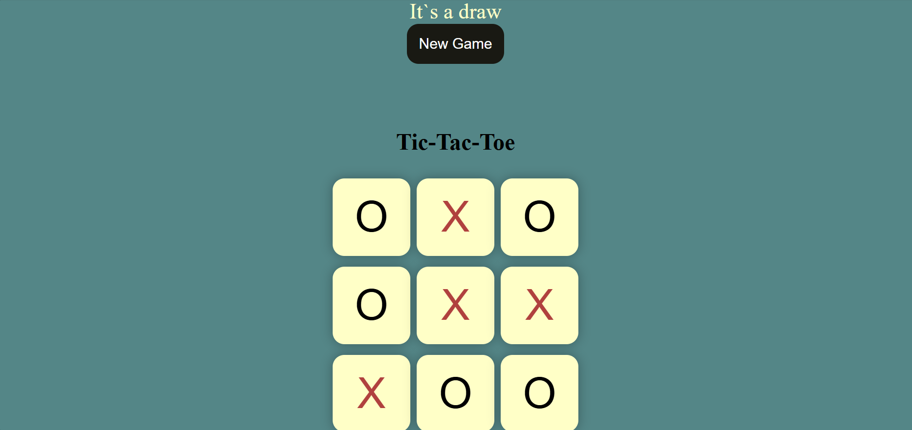

# Tic-Tac-Toe Game

A responsive Tic-Tac-Toe game built using HTML, CSS, and JavaScript with win and draw detection , turn-based gameplay, and reset functionality.

## Preview

## Features

- Two-player turn-based gameplay
- Player O starts the game
- Automatic win detection
- Automatic draw detection
- New Game and Reset Game functionality
- Dynamic game status updates
- Interactive game board

## Technologies Used

- HTML5
- CSS3
- JavaScript

## How to Run

1. Clone the repository.
2. Open the project folder.
3. Open `index.html` in your browser.
4. Start playing the game.

## Game Rules

- Player O starts the game.
- Players take turns placing O and X.
- The first player to get three symbols in a row wins.
- A winning combination can be horizontal, vertical or diagonal.
- If all cells are filled without a winner, the game ends in a draw.

## Purpose

This project was developed to strengthen practical JavaScript skills through game development, including DOM manipulation, event handling, conditional logic and interactive user interfaces.

[def]: preview/screenshot4.png